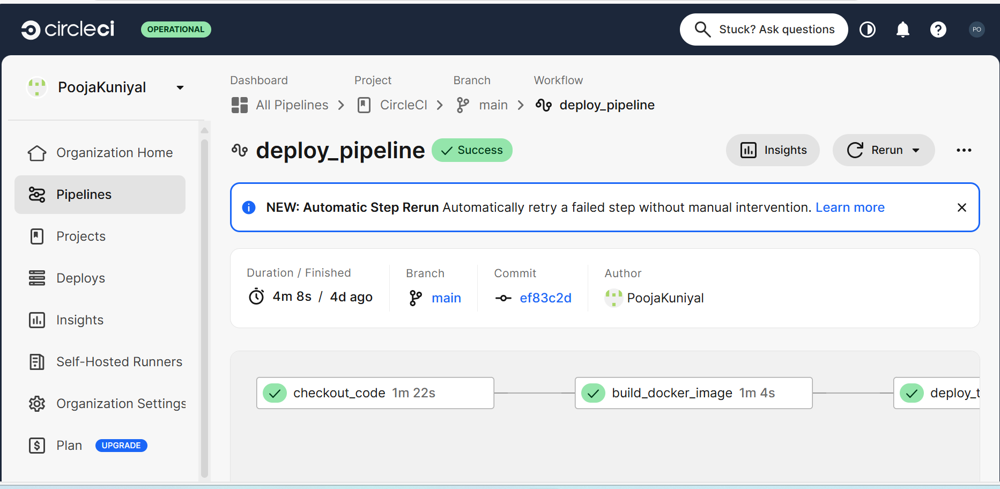
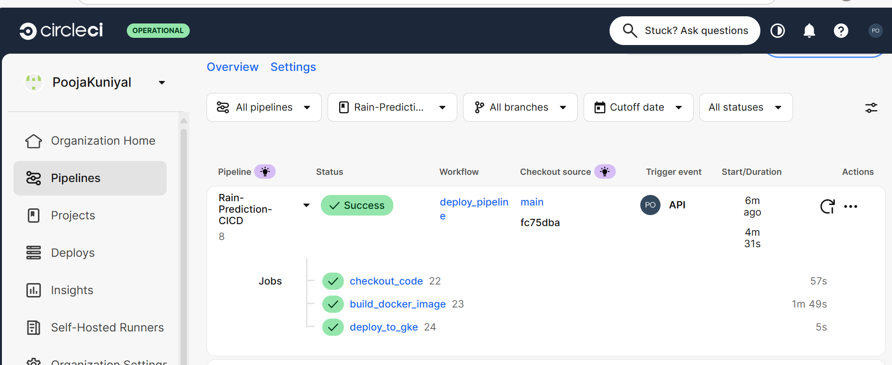
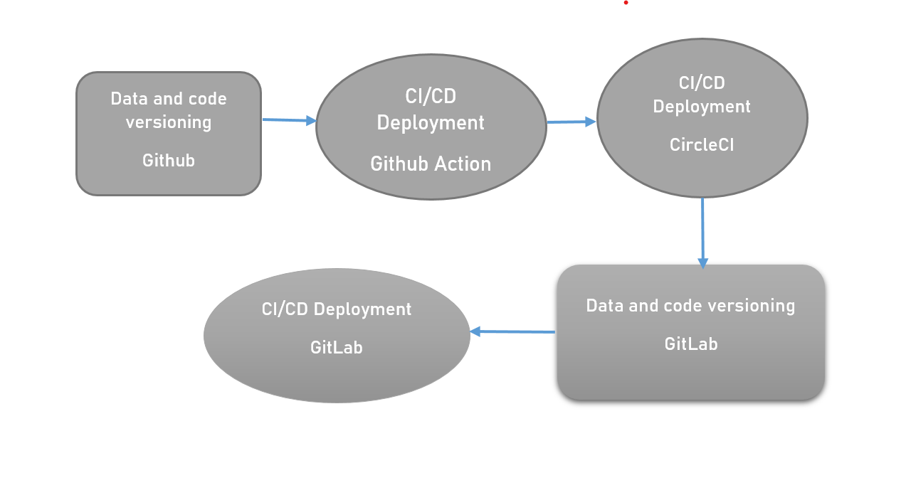

# 🌦️ Australian Rainfall Prediction with GithubAction and CircleCI CI/CD Deployment

## 🚀 Project Overview
This project predicts **next-day rainfall across Australia** using an **XGBoost-based Machine Learning pipeline**.  
It’s more than just a prediction model — it’s a **production-grade MLOps project** integrating CI/CD automation, experiment tracking, and cloud deployment.

From a real-world perspective, this solution helps **farmers, logistics providers, and weather services** make informed decisions — reducing losses, optimizing operations, and planning better for uncertain weather.

🎥 **Watch the Project Walkthrough:**  
👉 [Vimeo Video Demo](https://vimeo.com/1126419238)

---

## 🧠 How It Works

1. **Data Processing**
   - Dataset: *Australian Rainfall Prediction Dataset (BOM) kaggle*  
   - Cleaned missing values, handled categorical encoding.  
   - Extracted new features like Year, Month, Day from Date.

2. **Model Building**
   - Trained **XGBoost Classifier** to predict `RainTomorrow` (Yes/No).
   - Metrics used: Accuracy, Precision, Recall, F1-score.
   - Experiment tracking with **CometML** for performance comparison.

3. **MLOps Pipeline**
   - **Data and code Versioning:** Github for dataset and model version control.  
   - **Experiment Tracking:** CometML dashboard for hyperparameter tuning.  
   - **CI/CD Automation:**  
     - **GitHub Actions** → Runs tests, lints, and builds on every push.  
     - **CircleCI** → Handles Docker image build & deployment stages.  
   - **Containerization:** Model packaged with **Docker** for consistency.  
   - **Deployment:**  
     - Deployed on **Google Kubernetes Engine (GKE)** for scalability and fault tolerance.  

4. **Monitoring & Logging**
   - Real-time logs tracked via Kubernetes pods.  
   - TensorBoard used for visualizing model metrics and validation trends.

--



--



---

## 🗂️ Project Architecture

```text
📦 australian-rain-prediction-mlops
├── artiifacts/                     # Raw & processed datasets
├── notebooks/                # Jupyter notebooks for EDA & model training
├── src/                      # Data processing, model, and utility scripts
├── models/                   # Trained models (versioned with DVC)
├── .github/workflows/        # GitHub Actions CI/CD configurations
├── .circleci/config.yml      # CircleCI pipeline
├── Dockerfile                # Container definition
├── requirements.txt          # Dependencies
├── application.py                   # Entry point for model training & evaluation
└── README.md

--


| Category             | Tools Used                           |
| -------------------- | ------------------------------------ |
| **Language**         | Python                               |
| **Libraries**        | scikit-learn, XGBoost, pandas, numpy |
| **MLOps Tools**      | CometML                              |
| **CI/CD**            | GitHub Actions, CircleCI, GitLab     |
| **Containerization** | Docker                               |
| **Cloud Deployment** | Google Kubernetes Engine (GKE)       |
| **Visualization**    |  Matplotlib                          |

--
Due to Google Cloud Service Key issue failed to deploy on GitLab but attempted...
--
🧩 Key Features

✅ Automated data versioning using Github then GitLab

✅ Continuous integration via GitHub Actions

✅ Continuous delivery pipeline through CircleCI

✅ Experiment tracking and comparison with CometML

✅ Containerized deployment using Docker

✅ Scalable cloud deployment on GKE

✅ Reproducible and auditable workflow from data to deployment

--

